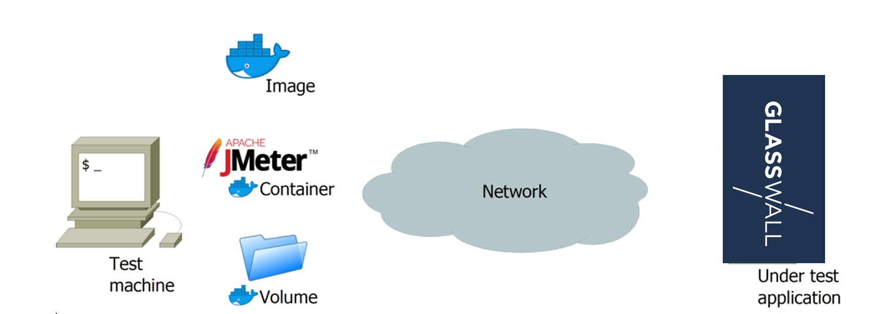
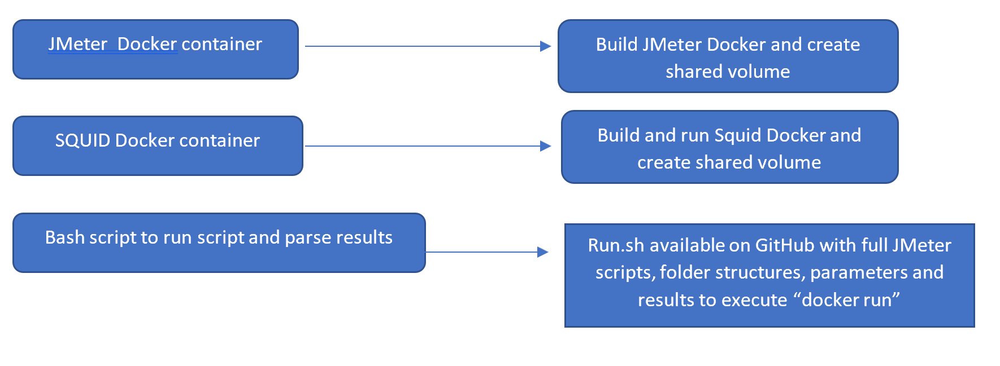
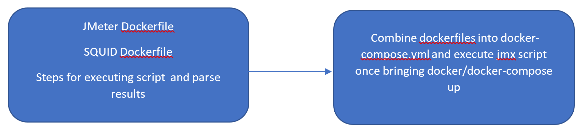

# k8 Performance Use Cases - JMeter Squid

### How JMETER interacts through DOCKER
Nice intro article: https://www.blazemeter.com/blog/make-use-of-docker-with-jmeter-learn-how
1) Passing JMeter arguments with the “docker run” command (e.g. which jmx script must be executed, script parameters, etc)
2) Fetching the result file (e.g. jtl and log file) using a shared folder on the test machine called Docker volume, that can be used to save result files after the container execution ends.

Notes to remember:
1) if the container modifies the file system, it does not persist after the container finishes. So to obtain JMeter results it’s necessary to set up an exchange folder with the ‘volume’ command.
2) Fetching the result file (e.g. jtl and log file) using a shared folder on the test machine called Docker volume, that can be used to save result files after the container execution ends.

### JMeter Docker Diagram

### Flow Charts for JMeter and Squid 
This task can be executed in two main ways and one to as combination

First one is having all the components separately:

Second way is to have everything in the same Dockerfile/Docker-compose.yml

Third option would be to have JMeter and SQUID in the same dockerfile/docker-compose and run jmx via custom bash script.

If we look long term, I would go with the first option since it can be easily adapted.
As shared Dockerfile contains paths and scripts not available, this is omitted for now and starting file is modified. 

### Installation
Prerequisite: You have Docker installed and running on your machine

**SQUID PROXY**

Docker image was taken from sameersbn/squid:3.5.27-2: https://github.com/sameersbn/docker-squid
To build the image run first or second command:
1) docker pull sameersbn/squid:3.5.27-2
2) docker build -t sameersbn/squid github.com/sameersbn/docker-squid
3) To run the docker image: docker run --name squid -d --restart=always --publish 3128:3128 -v "/srv/docker/squid/cache:/var/spool/squid" sameersbn/squid:3.5.27-2

**JMETER**

1) Use Dockerfile from GitHub or try check this image: https://github.com/justb4/docker-jmeter
2) Navigate to Dockerfile folder and run: o	docker build .
3) To check if image is built and image ID use: docker image ls
4) docker run IMAGEID
 